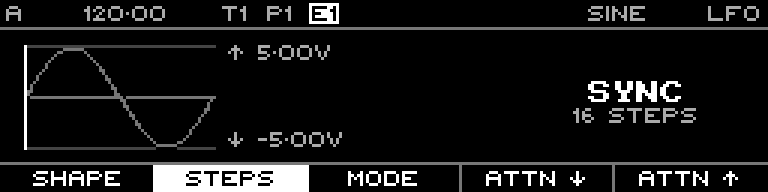

<!-- SPDX-FileCopyrightText: 2026 Axel Napolitano -->
<!-- SPDX-License-Identifier: CC-BY-NC-4.0 -->

# LFO — Steps

## Function

Sets the synchronised cycle length in Sync mode.

## Access

On the LFO page in Sync mode, press `F2` / **Steps**.

## Operation

Turn the encoder to change the cycle length. The current implementation clamps Sync speed to 1–64 steps.

From Munich with 
