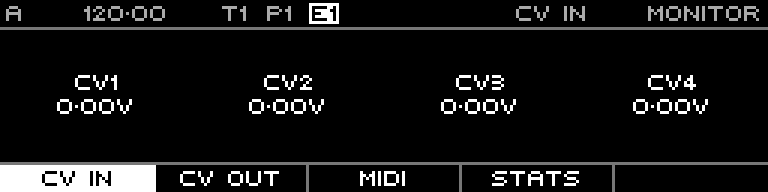

<!-- SPDX-FileCopyrightText: 2026 Axel Napolitano -->
<!-- SPDX-License-Identifier: CC-BY-NC-4.0 -->

# Monitor — CV In

## Function

Displays the current values observed on the CV inputs.

## Access

Press `PAGE` + `S8` (`MONITOR`) and select CV In.

## Operation

Use this page to verify incoming control voltages and patching.

From Munich with 
