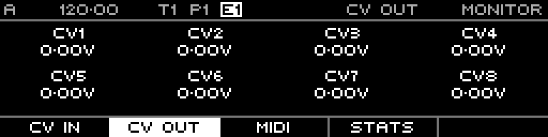

<!-- SPDX-FileCopyrightText: 2026 Axel Napolitano -->
<!-- SPDX-License-Identifier: CC-BY-NC-4.0 -->

# Monitor — CV Out

## Function

Displays the CV values currently being sent to the physical outputs.

## Access

Open Monitor and select CV Out.

## Operation

Use it to verify sequencer output values without measuring every channel externally.

From Munich with 
