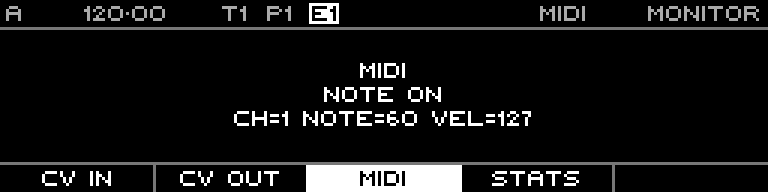

<!-- SPDX-FileCopyrightText: 2026 Axel Napolitano -->
<!-- SPDX-License-Identifier: CC-BY-NC-4.0 -->

# Monitor — MIDI

## Function

Displays incoming MIDI activity/messages for diagnosis.

## Access

Open Monitor and select MIDI.

## Operation

Send MIDI to the configured input to verify that data reaches Styr.

From Munich with 
