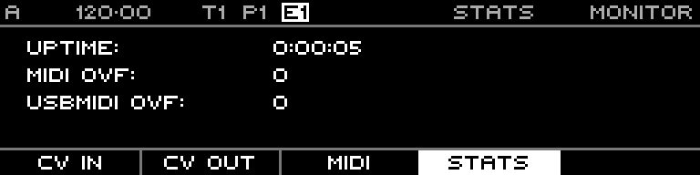

<!-- SPDX-FileCopyrightText: 2026 Axel Napolitano -->
<!-- SPDX-License-Identifier: CC-BY-NC-4.0 -->

# Monitor — Statistics

## Function

Displays runtime/diagnostic statistics exposed by the firmware.

## Access

Open Monitor and select Stats.

## Operation

Use this page for diagnostics rather than musical editing.

From Munich with 
