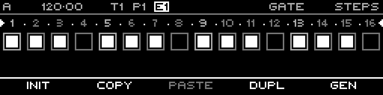

<!-- SPDX-FileCopyrightText: 2026 Axel Napolitano -->
<!-- SPDX-License-Identifier: CC-BY-NC-4.0 -->

# Note Steps — Context Menu

## Function

Provides sequence actions from the Note step editor, including generator access.

## Access

On the Note Steps page, hold `SHIFT` + `PAGE`.

## Operation

Use the function key shown for **Generate** to open the generator selector. Other context actions apply to the current sequence/layer as labeled.

From Munich with 
