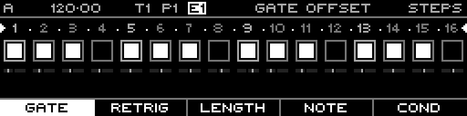

<!-- SPDX-FileCopyrightText: 2026 Axel Napolitano -->
<!-- SPDX-License-Identifier: CC-BY-NC-4.0 -->

# Note Steps — Gate Offset

## Function

Moves a gate earlier or later inside the step for per-step microtiming.

## Access

Select a Note track, open `PAGE` + `S1` (`STEPS`), then select this layer with the corresponding function key.

## Operation

Hold one or more steps and turn the encoder. Use small offsets for groove; the sequence timing grid itself is unchanged.

## Notes

Function keys can group several layers. Repeated presses cycle within a group; `SHIFT` + the function key returns directly to the group’s primary layer.

From Munich with 
