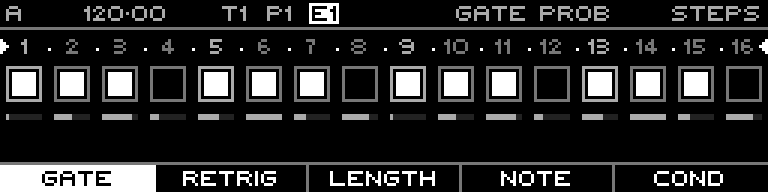

<!-- SPDX-FileCopyrightText: 2026 Axel Napolitano -->
<!-- SPDX-License-Identifier: CC-BY-NC-4.0 -->

# Note Steps — Gate Probability

## Function

Sets how likely an enabled gate is to fire.

## Access

Select a Note track, open `PAGE` + `S1` (`STEPS`), then select this layer with the corresponding function key.

## Operation

Hold one or more step keys and turn the encoder. Lower values introduce skipped gates without changing the underlying gate pattern.

## Notes

Function keys can group several layers. Repeated presses cycle within a group; `SHIFT` + the function key returns directly to the group’s primary layer.

From Munich with 
