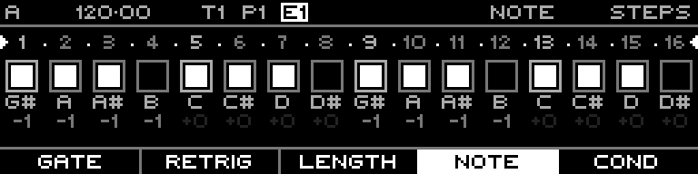

<!-- SPDX-FileCopyrightText: 2026 Axel Napolitano -->
<!-- SPDX-License-Identifier: CC-BY-NC-4.0 -->

# Note Steps — Note

## Function

Sets the pitch degree/value for each step.

## Access

Select a Note track, open `PAGE` + `S1` (`STEPS`), then select this layer with the corresponding function key.

## Operation

Hold one or more steps and turn the encoder. With a chromatic scale, `SHIFT` can be used for octave-sized movement; MIDI note entry is also available while holding a step.

## Notes

Function keys can group several layers. Repeated presses cycle within a group; `SHIFT` + the function key returns directly to the group’s primary layer.

From Munich with 
