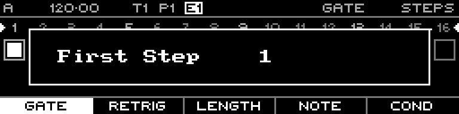

<!-- SPDX-FileCopyrightText: 2026 Axel Napolitano -->
<!-- SPDX-License-Identifier: CC-BY-NC-4.0 -->

# Note Quick Edit — First Step

## Function

Sets the first step of the sequence playback range.

## Access

From Note Steps, hold `PAGE` + `S9`.

## Operation

Keep the quick-edit chord active and turn the encoder to change the value without leaving the step-edit workflow.

From Munich with 
