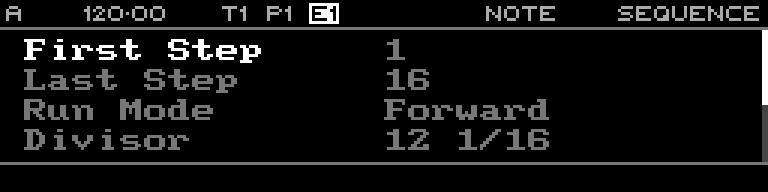

<!-- SPDX-FileCopyrightText: 2026 Axel Napolitano -->
<!-- SPDX-License-Identifier: CC-BY-NC-4.0 -->

# Note Sequence

## Function

Configures playback parameters for the selected Note sequence/pattern.

## Access

Select a Note track and press `PAGE` + `S2` (`SEQ`).

## Operation

Sequence parameters include First Step, Last Step, Run Mode, Divisor, Reset Measure, Scale and Root Note. First/last step define the active range within the 64-step sequence.

From Munich with 
