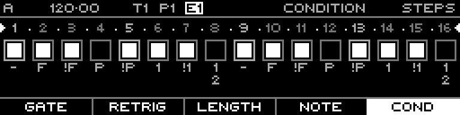

<!-- SPDX-FileCopyrightText: 2026 Axel Napolitano -->
<!-- SPDX-License-Identifier: CC-BY-NC-4.0 -->

# Note Steps — Shift + Condition

## Function

Jumps directly to the primary **Condition** layer instead of cycling through the other layers assigned to the same function group.

## Access

On Note Steps, hold `SHIFT` and press `F5`.

## Operation

Release `SHIFT` after the layer is selected; normal step editing then continues on the selected layer.

From Munich with 
