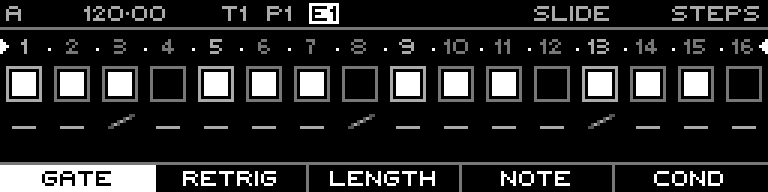

<!-- SPDX-FileCopyrightText: 2026 Axel Napolitano -->
<!-- SPDX-License-Identifier: CC-BY-NC-4.0 -->

# Note Steps — Slide

## Function

Controls whether the generated CV changes immediately at the start of the gate or glides smoothly to the new voltage according to the track’s Slide Time.

## Access

Select a Note track, open `PAGE` + `S1` (`STEPS`), then select this layer with the corresponding function key.

## Operation

Press/edit the selected steps on the Slide layer to enable or disable slide behaviour.

## Notes

Function keys can group several layers. Repeated presses cycle within a group; `SHIFT` + the function key returns directly to the group’s primary layer.

From Munich with 
