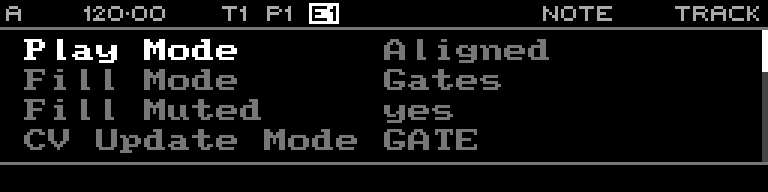

<!-- SPDX-FileCopyrightText: 2026 Axel Napolitano -->
<!-- SPDX-License-Identifier: CC-BY-NC-4.0 -->

# Note Track

## Function

Configures track-wide playback behaviour for a Note track.

## Access

Select a Note track and press `PAGE` + `S3` (`TRACK`).

## Operation

Track-level controls include play/fill behaviour, CV update mode, slide time, octave/transpose, rotation and probability/length biases. These affect playback without rewriting the sequence steps.

From Munich with 
