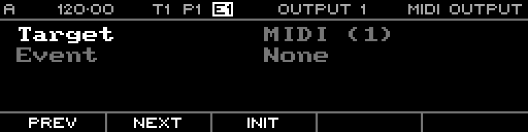

<!-- SPDX-FileCopyrightText: 2026 Axel Napolitano -->
<!-- SPDX-License-Identifier: CC-BY-NC-4.0 -->

# MIDI Output

## Function

Configures the sequencer’s MIDI output mappings.

## Access

Press `PAGE` + `T4` (`MIDIOUT`).

## Operation

Select the output entry and edit its destination/settings with the list-page encoder workflow.

From Munich with 
