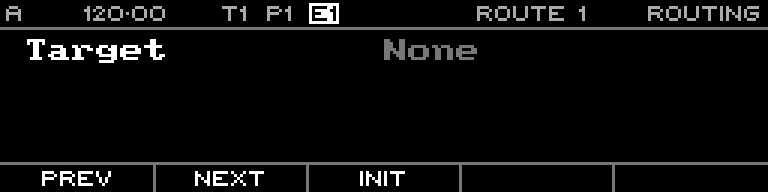

<!-- SPDX-FileCopyrightText: 2026 Axel Napolitano -->
<!-- SPDX-License-Identifier: CC-BY-NC-4.0 -->

# Routing

## Function

Creates modulation routes from CV or MIDI sources to routable sequencer parameters.

## Access

Press `PAGE` + `T3` (`ROUTING`).

## Operation

Select a route slot, source, target and target range. Per-track targets can be scoped to specific tracks.

From Munich with 
