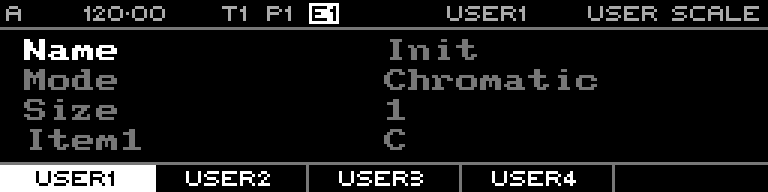

<!-- SPDX-FileCopyrightText: 2026 Axel Napolitano -->
<!-- SPDX-License-Identifier: CC-BY-NC-4.0 -->

# User Scale

## Function

Edits one of the user-defined scales used by Note sequences.

## Access

Press `PAGE` + `T5` (`U.SCALE`).

## Operation

Select a user scale and edit its note content. User scales can then be selected anywhere a sequence scale is available.

From Munich with 
