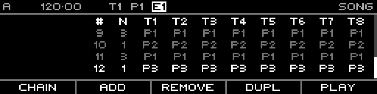

<!-- SPDX-FileCopyrightText: 2026 Axel Napolitano -->
<!-- SPDX-License-Identifier: CC-BY-NC-4.0 -->

# Song — Chain Example

## Function

Shows a populated song chain rather than the empty/default Song page.

## Access

Create several song slots/pattern entries on the Song page.

## Operation

The example illustrates:

- repeated slots
- per-track pattern variation
- evolving arrangement state across multiple slots

Use repeat counts before duplicating identical slots; reserve extra slots for intentional musical changes.

From Munich with 
