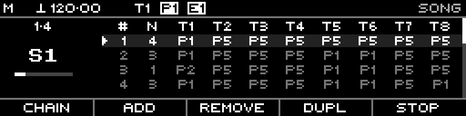

<!-- SPDX-FileCopyrightText: 2026 Axel Napolitano -->
<!-- SPDX-License-Identifier: CC-BY-NC-4.0 -->

# Song — Playback

## Function

Shows the Song page while the song chain is actively running.

## Access

Start song playback from the Song page.

## Operation

The page shows active-slot progress, repeat progress, and current per-track slot state as playback advances.

Important interaction:

- Slot changes follow slot repeat counts at measure boundaries.
- Synced Song start/stop requests follow the configured Sync Measure boundary.
- A direct pattern change outside Song flow stops song playback.

From Munich with 
