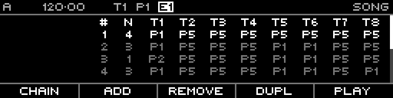

<!-- SPDX-FileCopyrightText: 2026 Axel Napolitano -->
<!-- SPDX-License-Identifier: CC-BY-NC-4.0 -->

# Song

## Function

Arranges patterns into a slot-based song structure (up to 64 slots).

## Access

Press `PAGE` + `S4` (`SONG`).

## Operation

Each slot can store:

- repeat count
- one pattern per track
- per-track song mute state

Common actions:

- **Chain**, **Add** / `SHIFT`+Add (**Insert**), **Remove**, **Duplicate**
- **Play/Stop**
- hold track keys while editing to target per-track pattern or mute actions

`SHIFT` + `F5` (**Play**) while clock is already running requests a synced song start.

From Munich with 
