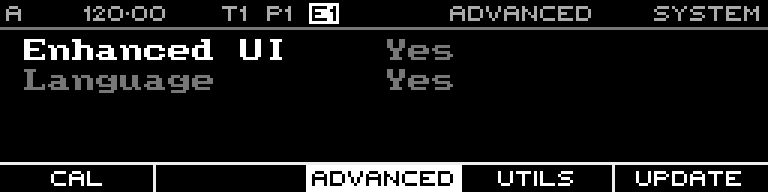

<!-- SPDX-FileCopyrightText: 2026 Axel Napolitano -->
<!-- SPDX-License-Identifier: CC-BY-NC-4.0 -->

# System — Advanced Settings

## Function

Shows the current Advanced Settings tab in the System area.

## Access

Open System and select **Advanced Settings**.

## Operation

The current firmware shows an **Advanced Settings** tab with rows for **Enhanced UI** and **Language**. In the current evidence-backed build, the page is visible but does not expose an editable workflow from this screen.

From Munich with 
