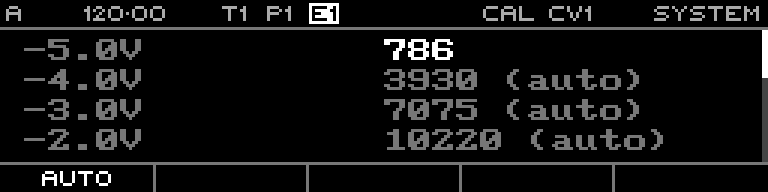

<!-- SPDX-FileCopyrightText: 2026 Axel Napolitano -->
<!-- SPDX-License-Identifier: CC-BY-NC-4.0 -->

# System — Calibration Edit

## Function

Shows a calibration value in edit mode.

## Access

On the Calibration page, select a calibration point and press the encoder.

## Operation

Rotate the encoder to correct the value against the measured physical voltage; leave edit mode before moving on.

From Munich with 
