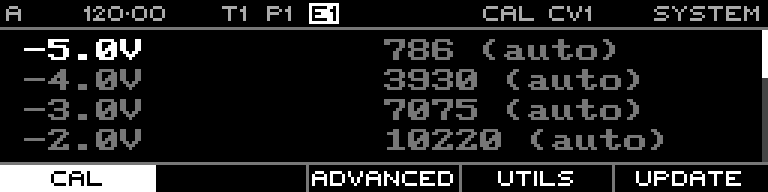

<!-- SPDX-FileCopyrightText: 2026 Axel Napolitano -->
<!-- SPDX-License-Identifier: CC-BY-NC-4.0 -->

# System — Calibration

## Function

Displays CV-output calibration values for the eight hardware channels.

## Access

Open System and select Calibration.

## Operation

Track buttons select output channels 1-8. Styr drives the calibration voltage to the outputs so you can compare the selected point against an accurate voltmeter.

Press the encoder to edit the selected calibration point, turn to correct it, and press again to leave edit mode. While editing, **Auto** returns the selected point to its automatic value.

On this page, `SHIFT` + `PAGE` opens settings actions for **Init**, **Save**, **Backup**, and **Restore**.

From Munich with 
