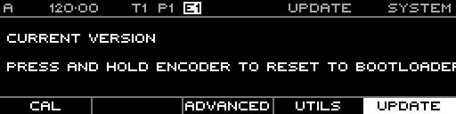

<!-- SPDX-FileCopyrightText: 2026 Axel Napolitano -->
<!-- SPDX-License-Identifier: CC-BY-NC-4.0 -->

# System — Update

## Function

Shows the installed firmware version and provides the software path into the bootloader for an SD card firmware update.

## Access

Open System and select Update.

## Operation

With a valid `UPDATE.DAT` in the SD card root, press and hold the encoder on this page (about 2 seconds) to reset into the bootloader update path.
For the complete SD card update procedure and ST-Link safety notes, see [`README_FIRMWARE_UPDATE.md`](../../../../README_FIRMWARE_UPDATE.md).

From Munich with 
