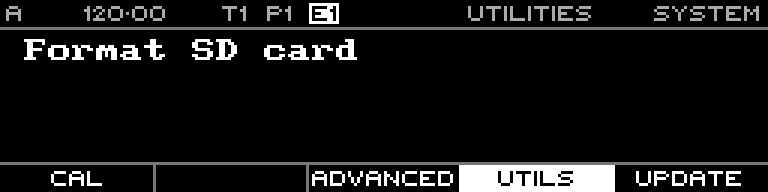

<!-- SPDX-FileCopyrightText: 2026 Axel Napolitano -->
<!-- SPDX-License-Identifier: CC-BY-NC-4.0 -->

# System — Utilities

## Function

Contains maintenance utilities. In the current firmware, the available utility is **Format SD Card**.

## Access

Open System and select Utilities.

## Operation

Select the utility and press the encoder to run it. Treat destructive utilities as maintenance operations, and back up any required project data first.

From Munich with 
