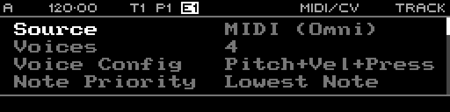

<!-- SPDX-FileCopyrightText: 2026 Axel Napolitano -->
<!-- SPDX-License-Identifier: CC-BY-NC-4.0 -->

# MIDI/CV Track

## Function

Converts incoming MIDI notes into one or more CV/gate voices.

## Access

Select a MIDI/CV track and press `PAGE` + `S3` (`TRACK`).

## Operation

Set this page in three practical passes:

1. **Input source**: choose the MIDI/USB source and channel.
2. **Voice behavior**: set **Voices**, **Voice Config**, **Note Priority**, and the accepted **Low Note/High Note** range.
3. **Performance controls**: set **Pitch Bend**, **Mod Range**, **Retrigger**, **Slide Time**, **Transpose**, and optional arpeggiator settings.

When more notes are held than available voices, note priority decides which notes stay active. CV and gate output jack assignment is configured on the [Layout page](../layout/README.md).

From Munich with 
