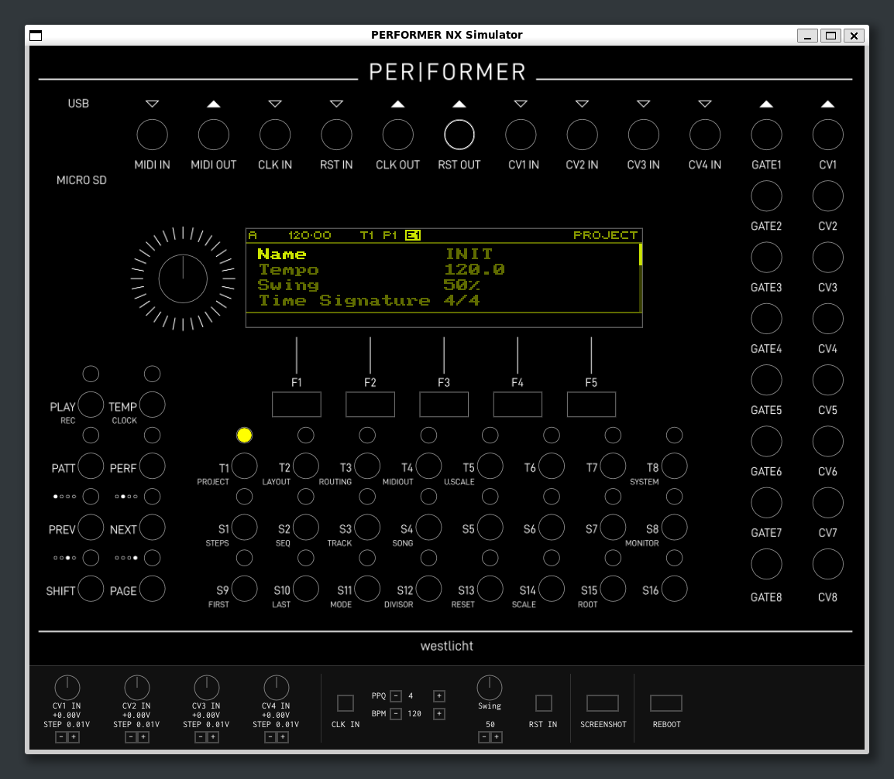

# Introduction

This document is a deterministic smoke test for the Styr manual publication toolchain. It exercises **body text**, *emphasis*, a [link](https://example.invalid/), headings, lists, tables and figure captions without pretending to be end-user documentation.

## Controls

- First list item.
- Second list item with **strong emphasis**.

| Ref. | Panel element |
|---:|:---|
| 1 | Rotary encoder |
| 2 | Transport control |
| 3 | Function key |

### Figure and caption

{width=75%}

The generated ODT must preserve the narrow 99 x 210 mm page, Styr footer, compact typography, black accent, and the supplied cover before LibreOffice exports the PDF.

::: {custom-style="StyrNote"}
**NOTE**

Semantic callouts keep formatting in the Writer template instead of hard-coding colors and spacing in Markdown.
:::

# Version history

| Version | Changes |
|:---|:---|
| 0.0.0 | Manual build-pipeline smoke test. |
